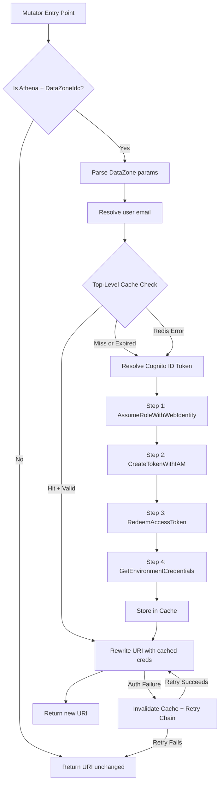

# Design Document: Environment Credential Caching

## Overview

This feature adds a top-level Redis caching layer to the DataZone connection mutator (`datazone_connection_mutator.py`) that checks for valid cached environment credentials **before** initiating any token exchange steps, including Cognito token resolution.

The existing code already has per-step caching (Steps 1–4 each cache individually) and a top-level cache check that occurs *after* Cognito token resolution. This enhancement moves the top-level check to the very beginning of the mutator entry point, adds expiration validation with a configurable TTL buffer, implements cache invalidation on authentication failures, and adds observability logging.

### Design Rationale

The current flow resolves the Cognito ID token (which may involve a Redis lookup + JWT decode + potential refresh) before checking the final credential cache. Since the final environment credentials are valid for several minutes, the majority of requests can be served directly from cache without touching Cognito at all. Moving the cache check earlier eliminates unnecessary work on the hot path.

## Architecture



### Key Design Decisions

1. **Cache check before Cognito resolution**: The user email is available from Flask-Login/g.user without any external calls. The cache key only requires user email + domain ID + environment ID, so we can check the cache immediately after resolving the user.

2. **Reuse existing cache infrastructure**: The feature uses the same `_cache_get`, `_cache_set`, `_build_cache_key` helpers and Redis db=2 instance already in the module. The top-level check uses the same cache key as Step 4 (`dz_mutator:env_creds:{user_email}:{hash}`), so a successful chain execution naturally populates the top-level cache.

3. **Expiration validation at read time**: Rather than relying solely on Redis TTL (which handles eviction), the top-level check also validates the `expiration` field in the cached payload against `current_time + TTL_Buffer`. This provides defense-in-depth against clock skew between the application and Redis.

4. **Retry-once on auth failure**: When cached credentials cause an `ExpiredTokenException` or `InvalidCredentialsException`, the cache entry is deleted and the full chain is retried exactly once. This self-heals without creating retry storms.

5. **Configurable TTL buffer**: The `CREDENTIAL_CACHE_TTL_BUFFER` environment variable (default: 60s) allows operators to tune the safety margin for different deployment scenarios.

## Components and Interfaces

### New Function: `_is_credential_expired`

```python
def _is_credential_expired(cached_entry: dict[str, Any], ttl_buffer: int) -> bool:
    """Check if a cached credential entry has expired or is about to expire.

    Args:
        cached_entry: Dict containing an 'expiration' field (Unix timestamp,
            ISO 8601 string, or datetime object).
        ttl_buffer: Safety buffer in seconds to subtract from expiration.

    Returns:
        True if credentials are expired or will expire within the buffer window.
    """
```

This function encapsulates the expiration validation logic, reusing the format-parsing approach from `_compute_expiration_ttl` but returning a boolean rather than a TTL value.

### New Function: `_get_ttl_buffer`

```python
def _get_ttl_buffer() -> int:
    """Read the TTL buffer from CREDENTIAL_CACHE_TTL_BUFFER env var.

    Returns:
        Buffer in seconds. Defaults to 60 if env var is unset or invalid.
    """
```

Reads and validates the `CREDENTIAL_CACHE_TTL_BUFFER` environment variable at module load time. Logs a warning if the value is invalid and falls back to 60 seconds.

### New Function: `_invalidate_cache_entry`

```python
def _invalidate_cache_entry(cache_key: str) -> None:
    """Delete a cache entry from Redis, logging the invalidation.

    Implements graceful degradation: if Redis is unavailable, logs a
    warning and returns without raising.

    Args:
        cache_key: The Redis key to delete.
    """
```

### Modified Function: `datazone_connection_mutator`

The entry point is restructured to:

1. Parse DataZone params and resolve user email (unchanged)
2. **NEW**: Build the final cache key and check for valid cached credentials
3. **NEW**: Validate expiration of cached entry using `_is_credential_expired`
4. If cache hit + valid: rewrite URI and return (skip entire chain)
5. If cache miss/expired: proceed with Cognito resolution and full chain
6. **NEW**: On auth failure from cached creds, invalidate and retry once

### Modified Function: `_compute_expiration_ttl`

Updated to accept an optional `buffer` parameter (defaulting to the configured `CREDENTIAL_CACHE_TTL_BUFFER` value) instead of the hardcoded 60-second buffer.

## Data Models

### Cached Credential Entry (unchanged format)

The cached entry stored in Redis remains the same dict structure produced by Step 4:

```python
{
    "aws_access_key_id": str,
    "aws_secret_access_key": str,
    "aws_session_token": str,
    "expiration": str  # ISO 8601 or Unix timestamp
}
```

### Cache Key Format (unchanged)

```
dz_mutator:env_creds:{user_email}:{sha256(domain_id:environment_id)[:16]}
```

The top-level check uses the identical key format as Step 4, ensuring cache coherence.

### Configuration

| Environment Variable | Type | Default | Description |
|---------------------|------|---------|-------------|
| `CREDENTIAL_CACHE_TTL_BUFFER` | int (seconds) | 60 | Safety buffer subtracted from credential expiration for cache validity checks |

## Correctness Properties

*A property is a characteristic or behavior that should hold true across all valid executions of a system — essentially, a formal statement about what the system should do. Properties serve as the bridge between human-readable specifications and machine-verifiable correctness guarantees.*

### Property 1: Expiration validity is determined by the formula (expiration - now - buffer)

*For any* expiration timestamp (as int, float, ISO string, or datetime) and any non-negative TTL buffer value, credentials are considered valid if and only if `expiration_epoch - current_time - buffer > 0`, and the computed TTL for cache storage equals `max(expiration_epoch - current_time - buffer, 0)`.

**Validates: Requirements 1.2, 2.1, 2.2, 2.3, 3.2**

### Property 2: Expiration format equivalence

*For any* future point in time, expressing that time as a Unix timestamp (int), a Unix timestamp (float), an ISO 8601 datetime string, or a Python datetime object SHALL produce the same validity determination and the same computed TTL (within 1 second tolerance for rounding).

**Validates: Requirements 2.4**

### Property 3: Cache key consistency between top-level check and Step 4

*For any* user email, domain ID, and environment ID, the cache key produced by the top-level cache check SHALL be identical to the cache key produced by Step 4 (`_get_environment_credentials`) for the same inputs.

**Validates: Requirements 1.5**

### Property 4: Redis errors never propagate to the caller

*For any* Redis exception type (ConnectionError, TimeoutError, RedisError, etc.) raised during cache get, cache set, or cache delete operations, the exception SHALL be caught internally and never propagate to the mutator's caller.

**Validates: Requirements 6.3**

### Property 5: Valid integer environment variable is used as buffer

*For any* valid integer string set as `CREDENTIAL_CACHE_TTL_BUFFER`, the `_get_ttl_buffer()` function SHALL return that integer value. For any non-integer string, it SHALL return 60.

**Validates: Requirements 7.2, 7.3**

## Error Handling

### Redis Unavailability

All Redis operations (`_cache_get`, `_cache_set`, `_invalidate_cache_entry`) are wrapped in try/except blocks that catch all exceptions. On failure:
- Log at WARNING level with the cache key and error context
- Return `None` (for gets) or silently continue (for sets/deletes)
- The mutator proceeds as if the cache doesn't exist

### Authentication Failures (Retry Logic)

When cached credentials are used to rewrite the URI but the downstream connection fails with `ExpiredTokenException` or `InvalidCredentialsException`:

1. The cache entry is deleted via `_invalidate_cache_entry`
2. A WARNING log is emitted with the cache key and error type
3. The full token exchange chain is retried once
4. If the retry succeeds, the new credentials are cached and used
5. If the retry also fails, the original URI is returned unchanged

**Note**: The retry logic requires integration with Superset's connection testing or query execution layer. The initial implementation will handle invalidation at the mutator level by detecting these errors if they occur during the chain itself (e.g., Step 4 returns expired domain credentials). Full downstream retry requires a callback mechanism that is out of scope for the initial implementation — the mutator will invalidate on the *next* invocation when the cached entry fails validation.

### Unparseable Expiration Values

If the `expiration` field in a cached entry cannot be parsed (not a valid timestamp, ISO string, or datetime), `_is_credential_expired` returns `True` (treat as expired), forcing a fresh exchange. This is logged at DEBUG level.

### Invalid Configuration

If `CREDENTIAL_CACHE_TTL_BUFFER` contains a non-integer value:
- Log at WARNING level once at module load time
- Fall back to the default of 60 seconds
- The mutator continues to function normally

## Testing Strategy

### Property-Based Tests (Hypothesis)

The project already uses Hypothesis (`.hypothesis/` directory exists). Property tests will use `hypothesis` with a minimum of 100 examples per property.

Each property test will be tagged with a comment referencing the design property:
```python
# Feature: environment-credential-caching, Property 1: Expiration validity is determined by the formula (expiration - now - buffer)
```

**Property tests to implement:**

1. **Expiration validity computation** — Generate random timestamps and buffer values, verify the formula `expiration - now - buffer` determines validity and TTL correctly.
2. **Format equivalence** — Generate random future timestamps, express in all supported formats, verify identical results.
3. **Cache key consistency** — Generate random emails/domain IDs/environment IDs, verify top-level and Step 4 produce identical keys.
4. **Redis error containment** — Generate various Redis exception types, verify none propagate.
5. **Configuration parsing** — Generate random integer strings and non-integer strings, verify correct parsing behavior.

### Unit Tests (pytest)

Example-based tests for specific scenarios:

- Top-level cache check is performed before Cognito token resolution (mock ordering)
- Cache hit with valid credentials skips the entire chain
- Cache miss triggers full chain execution
- Cache invalidation on `ExpiredTokenException` deletes the entry
- Retry succeeds after invalidation
- Retry fails → original URI returned
- Observability logs contain required fields (user email, domain ID, TTL)
- Redis unavailability logs warning and proceeds with chain
- `CREDENTIAL_CACHE_TTL_BUFFER` defaults to 60 when unset

### Integration Tests

- End-to-end flow with a real Redis instance (docker-compose test environment)
- Verify cache population after successful chain execution
- Verify cache eviction after TTL expires

### Test Configuration

- Property tests: minimum 100 iterations (`@settings(max_examples=100)`)
- Use `freezegun` or `time_machine` for deterministic time-based tests
- Mock `boto3` clients and `requests` for unit tests (no real AWS calls)
- Use `fakeredis` for Redis mocking in unit/property tests
